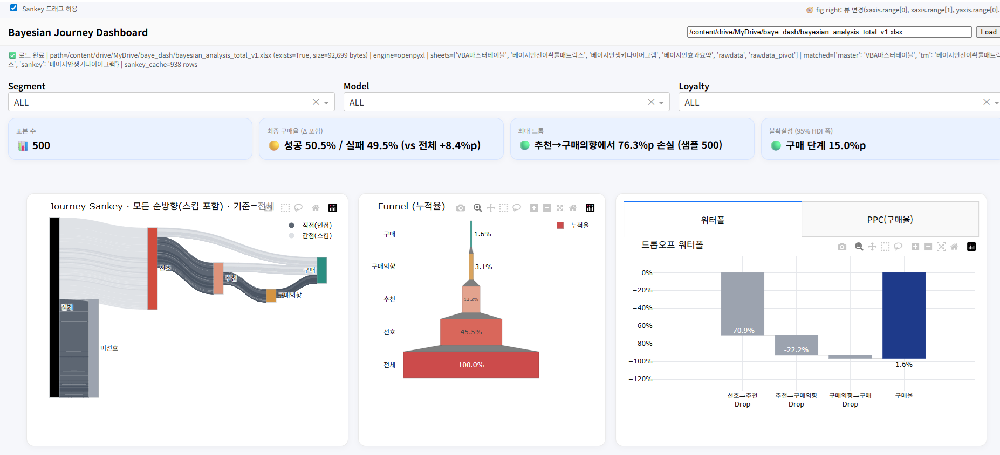

# 주의사항
📍이 저장소의 데이터셋은 **실제 브랜드 조사 데이터가 아님**. 연구/데모 목적을 위해 임의 생성한 **샘플 데이터**\
📍Bayesian_analysis.py / Dashboard.py에는 간단한 로직만이 수록되어 있음

# bayesian_dashboard
세그·모델·충성도별로 ‘선호→추천의향→구매의향→실제구매’ 퍼널 전환율을 위계적 베이지안으로 추정\
병목 단계와 리스크(Fail Prob)를 정량화하고, 리프트·SNR 기반으로 어느 고객군에 무엇을 먼저 투자할지 우선순위를 뽑아 매출 전환 최적화에 활용

# 분석방법
📍베이지안 계층 로지스틱 회귀로 4단계 퍼널(선호→추천→의도→구매) 전환율 추정\
📍랜덤효과: 세그먼트, 세그-모델(중첩), 충성도, 세그×충성도, 세그-모델×충성도\
📍포스터리어 샘플로 평균·95% CI·SNR·Fail Prob(기준 대비 악화확률) 산출\
📍서열 로지스틱 MLE로 선호도 컷포인트를 기존 리포트와 호환되게 유지\
(과거 데이터 분석 시 베이지안을 사용하지 않았더라도, 호환이 가능)

# 주 사용 라이브러리
📍PyMC(베이지안 추정), NumPy / Pandas (연산/집계), SciPy(MLE 최적화) / plotly(Dashboard)

# 변수
📍구매고객 데이터: 가격대별 Segment(Highend/Midrange/Lowend), 모델별 Segment, 브랜드 충성도별 Segment\
📍종속변수: 선호도, 추천의향, 구매의향, 실제구매

# 주요 분석단계
## 베이지안 분석단계
📍전처리: CSV 로드 → 충성도 지표에서 Top2/Bot2/이외 기준으로 집단 분류(Low/Mid/High) → 이항 타깃(서열 데이터 분석도 사용할 수 있도록 임계값 설정)\
📍인코딩: 세그, 세그-모델(중첩), 충성도 카테고리 코드화 ➡️ 고객 그룹을 큰 그룹(Segment)부터 세부 모델단위 Segment까지 분류해서 확인\
📍조건부 Flow 생성: recommend | preference=1 → intent | recommend=1 → purchase | intent=1 \
📍모델 적합(단계별): PyMC 계층 로지스틱 4개(각 단계 독립) ➡️ n수가 적은 경우에도, 상위 계층의 분포를 빌려 와서 신뢰도 있는 예측 가능\
📍Posterior 집계(그룹/교차레벨별): 전환율 평균·95% CI, SNR, 리프트(전체 대비), Fail Prob vs 브랜드, 드롭아웃율(1−p), 체인 전환율(pref×rec×intent×buy) \
📍스코어링/등급: 가중합(기본: 0.2/0.3/0.0/0.5) → 분위수로 A~D\
📍보조 추정: 선호도 서열 로지스틱 MLE 컷포인트 요약

## 대시보드 구축단계
📍Interaction Chart 구축\
📍gunicorn

## 대시보드 불러오기

## 예시이미지

## 보완사항
📍인사이트 도출 & 비즈니스 연계성 강화 필요

